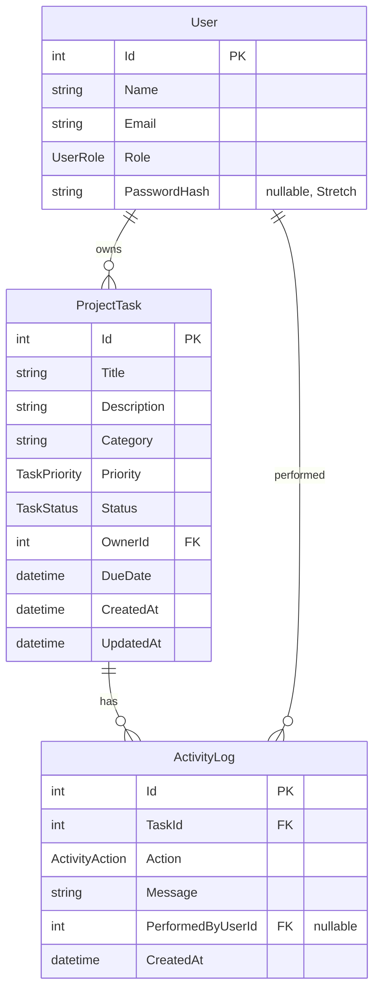

# Data Model

## Entity Relationship

## Enums

| Enum | Values |
|------|--------|
| `UserRole` | `Admin`, `Member` |
| `TaskPriority` | `Low`, `Medium`, `High` |
| `TaskStatus` | `Planned`, `InProgress`, `Completed` |
| `ActivityAction` | `Created`, `Updated`, `StatusChanged` |

## Tables

### Users

| Column | Type | Notes |
|--------|------|-------|
| Id | int | PK, identity |
| Name | string(100) | Required |
| Email | string(200) | Required, unique in seed |
| Role | string | Enum as string in DB |
| PasswordHash | string | Nullable; seeded at runtime (Stretch) |

### ProjectTasks

| Column | Type | Notes |
|--------|------|-------|
| Id | int | PK |
| Title | string(200) | Required |
| Description | string(2000) | Optional |
| Category | string(100) | Optional |
| Priority | string | Default `Medium` |
| Status | string | Default `Planned` |
| OwnerId | int | FK → Users, restrict delete |
| DueDate | datetime | Nullable, UTC |
| CreatedAt | datetime | UTC |
| UpdatedAt | datetime | UTC |

### ActivityLogs (Stretch)

| Column | Type | Notes |
|--------|------|-------|
| Id | int | PK |
| TaskId | int | FK → ProjectTasks |
| Action | string | Enum |
| Message | string | Human-readable summary |
| PerformedByUserId | int | Nullable FK → Users |
| CreatedAt | datetime | UTC |

## Migrations

| Migration | Purpose |
|-----------|---------|
| `20260720162312_InitialCreate` | Users, ProjectTasks, seed data |
| `20260720175633_Phase6_StretchFeatures` | ActivityLog, User.PasswordHash |

Location: `backend/LearningDashboard.Api/Migrations/`

## Seed Data

See [database/seed-data/README.md](database/seed-data/README.md).

## Dashboard Count Queries

| Card | Query rule |
|------|------------|
| Total | Count all `ProjectTasks` |
| Completed | `Status == Completed` |
| In Progress | `Status == InProgress` |
| Overdue | `DueDate < today` AND `Status != Completed` |
| High Priority | `Priority == High` (all statuses) |

Implemented in `DashboardService`.
