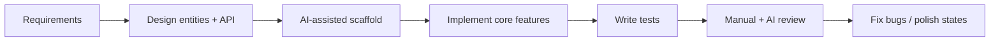

# .NET AI Capability Exercise — Project Plan

A phased plan aligned with the participant guide effort split: **Part A (20%)**, **Part B (60%)**, **Part C (20%)**.

---

## 1. Recommended Stack


| Layer          | Choice                          | Why                                          |
| -------------- | ------------------------------- | -------------------------------------------- |
| Backend        | ASP.NET Core Web API (.NET 8)   | Matches exercise; clean REST API             |
| ORM            | Entity Framework Core           | Persistence + migrations                     |
| Database       | SQLite (dev)                    | Simple, survives restart, no secrets         |
| Frontend       | React + TypeScript + Vite       | Strong fit for loading/empty/error states    |
| API client     | fetch or axios                  | Straightforward                              |
| Backend tests  | xUnit + WebApplicationFactory   | Integration tests for create → list → update |
| Frontend tests | Vitest + React Testing Library  | Component/integration for core flow          |
| Docs           | `tool-workflow.MD`, `README.md` | Part A + repo setup                          |


**Optional (stretch):** Docker, GitHub Actions CI.

---


## 2. Repository Structure

```
learning-dashboard/
├── backend/
│   ├── LearningDashboard.Api/
│   ├── LearningDashboard.Api.Tests/
│   └── LearningDashboard.sln
├── frontend/
│   ├── src/
│   │   ├── components/
│   │   ├── pages/
│   │   ├── services/
│   │   └── types/
│   └── package.json
├── docs/
│   └── tool-workflow.MD          # Part A
├── .gitignore                    # exclude *.db, .env, secrets
└── README.md
```

---


## 3. Part A: AI Workflow Foundation (~20% effort)

**Deliverable:** `tool-workflow.MD` covering:


| #   | Section                | What to write                                                                       |
| --- | ---------------------- | ----------------------------------------------------------------------------------- |
| 1   | Primary AI tool        | e.g. Cursor — agent mode, chat, rules                                               |
| 2   | Project context        | Rules, README, entity specs, API contracts, folder structure                        |
| 3   | Workflow by phase      | Requirement analysis → design → codegen → validation → testing → debugging → review |
| 4   | What to avoid sharing  | Secrets, PII, prod credentials, proprietary data                                    |
| 5   | Reuse in real projects | Templates, rules, CI gates, review checklist                                        |


### Suggested AI workflow (document as you build Part B)




**Tip:** Write Part A **while** building Part B — capture real prompts and decisions, not generic boilerplate.

---


## 4. Part B: Full-Stack Mini Project (~60% effort)


### Business context

A small dashboard for tracking learning goals, project tasks, ownership, due dates, and progress — what is planned, in progress, completed, and overdue.

### Entities

**User** (seeded only)

- `id`, `name`, `email`, `role`

**ProjectTask**

- `id`, `title`, `description`, `category`, `priority`, `status`, `ownerId`, `dueDate`, `createdAt`, `updatedAt`


### Core features (mandatory)

1. Create a task or project item
2. View dashboard summary cards
3. List tasks
4. View task detail
5. Update task fields (title, description, priority, status, owner, due date)
6. Mark the item in progress or completed
7. Keyword search or one filter (status)
8. Persist all data; data survives restart
9. Validate required fields
10. Show loading, empty, success, and error states


### Dashboard summary cards


| Card          | Rule                                        |
| ------------- | ------------------------------------------- |
| Total items   | All tasks                                   |
| Completed     | `status == Completed`                       |
| In progress   | `status == InProgress`                      |
| Overdue       | `dueDate < today` AND `status != Completed` |
| High priority | `priority == High` (all statuses)           |


Counts must update correctly from real data.

---


### Phase 1 — Foundation (Day 1)

**Backend**

- [x] Create solution: Web API + test project
- [x] Define `User` and `ProjectTask` entities
- [x] EF Core + SQLite + migrations
- [x] Seed 2–3 users (no auth in core)
- [x] Global validation (Data Annotations or FluentValidation)
- [x] CORS for frontend

**Frontend**

- [x] Vite + React + TypeScript scaffold
- [x] Vitest + React Testing Library (installed; tests in Phase 4)

**Exit criteria:** API runs, DB seeds, frontend scaffold loads.

---


### Phase 2 — Core API (Day 1–2) — complete


| Endpoint                       | Purpose                                               |
| ------------------------------ | ----------------------------------------------------- |
| `GET /api/dashboard/summary`   | Total, completed, in-progress, overdue, high-priority |
| `GET /api/tasks`               | List (+ `?status=` or `?search=`)                     |
| `GET /api/tasks/{id}`          | Detail                                                |
| `POST /api/tasks`              | Create                                                |
| `PUT /api/tasks/{id}`          | Update                                                |
| `PATCH /api/tasks/{id}/status` | In progress / completed (optional if PUT covers it)   |
| `GET /api/users`               | Owners dropdown                                       |


**Exit criteria:** All endpoints work via Swagger/Postman; counts match seeded data.

---


### Phase 3 — Core UI (Day 2–3) — complete

**Implementation checklist**

- [x] `react-router-dom` routing + `AppLayout` nav
- [x] TypeScript types matching API DTOs (`frontend/src/types/`)
- [x] API service layer with `ApiError` handling (`frontend/src/services/`)
- [x] Shared UI state components: Loading, Empty, Error, Success
- [x] Dashboard page — 5 summary cards
- [x] Task list — table, status filter, debounced search
- [x] Create task page — `TaskForm` + owner dropdown
- [x] Task detail page — read-only view + status actions
- [x] Edit task page — pre-filled form, `PUT` on save
- [x] Client-side form validation (blur + submit, server error merge)
- [x] Vite dev proxy (`/api` → `localhost:5004`)
- [x] Basic styling (`styles/shared.css`, responsive layout)
- [x] Manual verification — create → list → update → complete flow (15/15 checks)

**Routes**

| Route | Page |
|-------|------|
| `/` | Dashboard |
| `/tasks` | Task list |
| `/tasks/new` | Create task |
| `/tasks/:id` | Task detail |
| `/tasks/:id/edit` | Edit task |

**Feature mapping**

| Feature | UI behavior | Status |
| ------- | ----------- | ------ |
| Dashboard      | 5 summary cards from API                                   | Done |
| Task list      | Table/cards; status filter or keyword search               | Done |
| Create task    | Form with validation messages                              | Done |
| Task detail    | Read-only view + edit                                      | Done |
| Update task    | Edit title, description, priority, status, owner, due date | Done |
| Status actions | Mark in progress / completed                               | Done |


**Frontend states (required — signature piece)**


| State   | Where                           | Status |
| ------- | ------------------------------- | ------ |
| Loading | Dashboard, list, detail, forms  | Done |
| Empty   | No tasks                        | Done |
| Success | Create/update toast or message  | Done |
| Error   | API failures, validation errors | Done |


**Exit criteria:** Full create → list → update flow in browser; counts update after changes. **Met** (verified Step 14).

**Run frontend:** `cd frontend && npm install && npm run dev` → `http://localhost:5173` (requires backend on `:5004`).

---


### Phase 4 — Mandatory Tests (Day 3)

**Backend integration tests (priority)** — complete

- [x] Create task → appears in list (`TaskFlowTests.CreateTask_AppearsInList`)
- [x] Update task → fields persist (`TaskFlowTests.UpdateTask_PersistsFields`)
- [x] Dashboard counts after create/update/complete (`DashboardTests.DashboardCounts_UpdateAfterCreateUpdateAndComplete`)
- [x] Validation rejects invalid create (`TaskFlowTests.CreateTask_WithEmptyTitle_ReturnsBadRequest`)
- [x] Status filter or search returns expected results (`GetTasks_WithStatusFilter`, `GetTasks_WithSearch`)

**Frontend tests (at least one path)** — complete

- [x] Dashboard renders counts from mocked API (`DashboardPage.test.tsx`)
- [x] Create form validation or successful submit flow (`TaskForm.test.tsx`, `taskFormValidation.test.ts`)

**Exit criteria:** `dotnet test` and `npm test` pass locally.

---


### Phase 5 — Polish and hardening (Day 4) — complete

- [x] `.gitignore`: `*.db`, `bin/`, `obj/`, `node_modules/`, `.env`, `dist/`
- [x] README: clone-to-run setup, backend/frontend, tests, troubleshooting
- [x] Restart app → data still present (SQLite file + migrations; verified locally)
- [x] Acceptance criteria pass (backend tests + manual/API verification; frontend tests Phase 4 pending)

**Clone-to-run guarantee:** Repo includes source, EF migrations (schema + seed), `package-lock.json`, `NuGet.Config`, and `.env.example`. Generated artifacts are gitignored and recreated on first run.

---


### Phase 6 — Stretch (only if core is solid)


| Stretch                          | Effort     | Notes                              |
| -------------------------------- | ---------- | ---------------------------------- |
| ActivityLog / audit              | Medium     | Log create/update on `ProjectTask` |
| Multi-filter + sort + pagination | Medium     | Query params on `GET /api/tasks`   |
| Responsive + a11y                | Low–medium | Focus, labels, keyboard nav        |
| Auth + RBAC                      | High       | JWT + role checks — only if time   |
| Docker + CI                      | Medium     | `docker-compose`, GitHub Actions   |
| AI prompt templates              | Low        | `docs/prompts/` for reuse evidence |


**Rule:** Do not add stretch at the cost of core functionality, testing, or `tool-workflow.MD`.

---


## 5. Part C: Submission and Reflection (~20% effort)

Completed through the participation form.

**Before submitting**

- [ ] Public or shareable repo URL
- [x] `tool-workflow.MD` complete
- [x] README with run instructions
- [x] Core tests passing (`dotnet test` 6/6, `npm test` 7/7)
- [x] No secrets in git history (nothing committed yet; `.gitignore` in place)
- [x] Participation form answers drafted (`docs/SUBMISSION-DRAFT.md`)

---


## 6. Core Acceptance Criteria Checklist

**Verified:** 2026-07-20 — all 12 criteria met.

| # | Criterion | How to verify | Status | Evidence |
| --- | --- | --- | --- | --- |
| 1 | Create via UI | Manual + integration test | **Pass** | `TaskFlowTests.CreateTask_AppearsInList`; `CreateTaskPage` + `TaskForm.test.tsx` submit flow; live API create → list |
| 2 | Dashboard from backend | API test + UI | **Pass** | `GET /api/dashboard/summary` returns counts; `DashboardPage.test.tsx` renders mocked API data |
| 3 | List from DB | Integration test | **Pass** | `TaskFlowTests.CreateTask_AppearsInList`; `GET /api/tasks` returns persisted tasks |
| 4 | Task detail view | Manual | **Pass** | `TaskDetailPage` at `/tasks/:id`; `GET /api/tasks/{id}` returns full task |
| 5 | Update details/status | Manual + test | **Pass** | `TaskFlowTests.UpdateTask_PersistsFields`; `PATCH /status` verified live; `EditTaskPage` + status actions on detail |
| 6 | Search or status filter | API + UI test | **Pass** | `GetTasks_WithStatusFilter_ReturnsMatchingTasks`, `GetTasks_WithSearch_ReturnsMatchingTasks`; `TaskListPage` filter + debounced search |
| 7 | Dashboard counts correct | Dedicated test suite | **Pass** | `DashboardTests.DashboardCounts_UpdateAfterCreateUpdateAndComplete`; live summary updates after create/complete |
| 8 | Data survives restart | Stop/start API, check DB | **Pass** | SQLite at `Data/learningdashboard.db` (gitignored); `db.Database.Migrate()` on startup; EF migrations + seed in repo; data present after sessions |
| 9 | Backend validation | POST invalid payload → 400 | **Pass** | `CreateTask_WithEmptyTitle_ReturnsBadRequest`; live empty-title POST → 400; `taskFormValidation.test.ts` client-side |
| 10 | Loading/empty/success/error | Manual UI review | **Pass** | `LoadingSpinner`/`EmptyState`/`ErrorMessage`/`SuccessMessage` on Dashboard, List, Detail, Create, Edit pages |
| 11 | No secrets | Scan repo, check `.gitignore` | **Pass** | No passwords/API keys in source; `.env` + `*.db` gitignored; seed uses `@example.com` |
| 12 | Core tests pass | `dotnet test` / `npm test` | **Pass** | `dotnet test` → 6/6; `npm test` → 7/7 |

---


## 7. Suggested Timeline (4–5 days)


| Day | Focus                                                         |
| --- | ------------------------------------------------------------- |
| 1   | Scaffold, entities, DB, seed, basic API                       |
| 2   | All endpoints + dashboard logic                               |
| 3   | Frontend core pages + states                                  |
| 4   | Tests + bug fixes                                             |
| 5   | `tool-workflow.MD`, README, submission form, optional stretch |


---


## 8. AI Usage Strategy (for Part A + building)


| Phase        | Use AI for                            | You own                        |
| ------------ | ------------------------------------- | ------------------------------ |
| Requirements | Clarify entities, acceptance criteria | Final scope                    |
| Design       | API shape, folder structure           | Architecture decisions         |
| Codegen      | Boilerplate, DTOs, components         | Business rules (overdue logic) |
| Validation   | Test cases, edge cases                | Assert correct behavior        |
| Debugging    | Stack traces, EF issues               | Reproduce and verify fix       |
| Review       | Security, missing states              | Final merge                    |


**Avoid sharing with AI:** connection strings with passwords, real emails, API keys, employer-specific data.

---


## 9. Risk Mitigation


| Risk                   | Mitigation                                       |
| ---------------------- | ------------------------------------------------ |
| Overdue logic wrong    | Write test with fixed dates                      |
| Dashboard counts drift | Single service method; test after every mutation |
| UI states skipped      | Build loading/error first per page               |
| Stretch eats core time | Freeze stretch until tests pass                  |
| Secrets committed      | SQLite file only; no `.env` in repo              |


---


## 10. Immediate Next Steps

1. Create repo `learning-dashboard` with backend + frontend folders
2. Implement entities + migrations + user seed
3. Build dashboard summary endpoint first (drives tests)
4. Build frontend dashboard + task list
5. Add integration tests for create → list → update → counts
6. Write `tool-workflow.MD` from your actual build session
7. Submit via participation form

